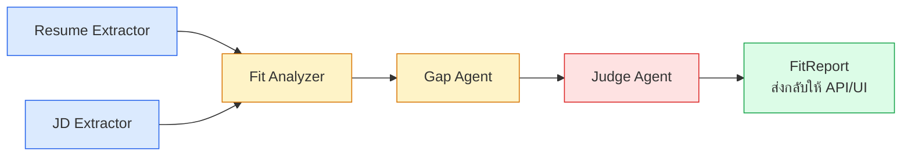
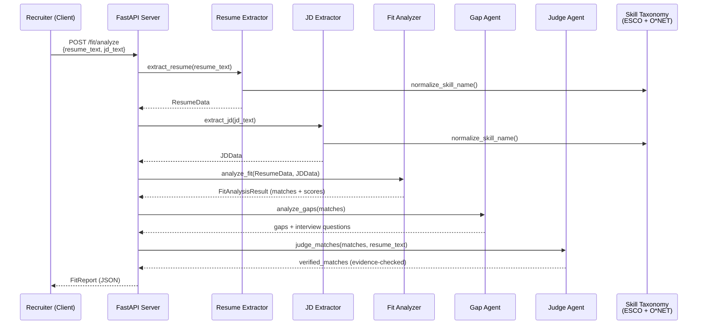

# System Architecture — Resume ↔ JD Fit Analyzer

## Agent Pipeline (Flowchart จาก PRD-6)

## End-to-End Request Flow

## Component Responsibility Table

| Component | Input | Output | Notes |
|---|---|---|---|
| Resume Extractor | Resume text | `ResumeData` | LLM + Pydantic (`instructor`) |
| JD Extractor | JD text | `JDData` | Must-have / nice-to-have split |
| Skill Normalizer | Raw skill name | Canonical skill name | Embedding similarity vs ESCO/O*NET taxonomy |
| Fit Analyzer | `ResumeData` + `JDData` | `matches` + scores | Scores computed in Python (deterministic), not by LLM |
| Gap Agent | `matches` | `gaps` + interview questions | Only reasons about missing/partial skills |
| Judge Agent | `matches` + original resume text | `verified_matches` | Rejects claims without textual evidence |

## Data Stores

- **Skill Taxonomy**: `skill_taxonomy_master.csv` (ESCO + O*NET, 22.7k skills) + cached embeddings (`.npy`)
- **Occupation-Skill Mapping**: `occupation_skill_mapping.csv` (used to cross-check JD-implied role requirements)
- **Gold Dataset**: `gold_dataset_final.json` (15 resume-JD pairs with gold labels, for evaluation)
